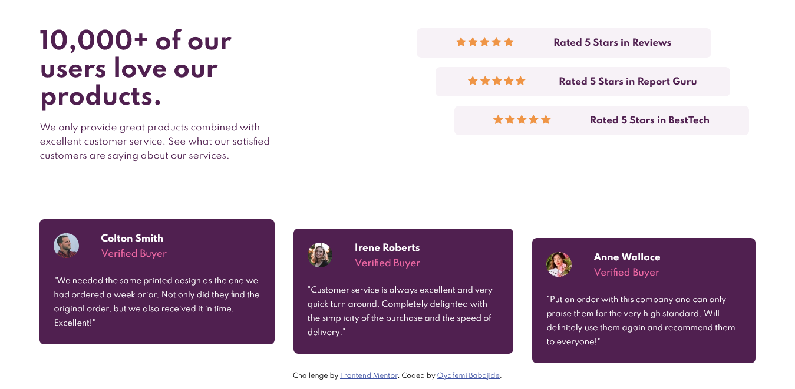
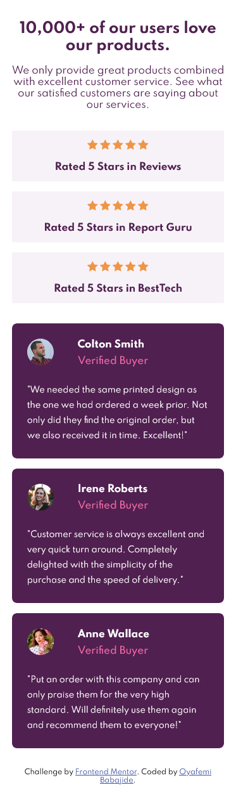

# Frontend Mentor - Social proof section solution

This is a solution to the [Social proof section challenge on Frontend Mentor](https://www.frontendmentor.io/challenges/social-proof-section-6e0qTv_bA). Frontend Mentor challenges help you improve your coding skills by building realistic projects.

## Table of contents

- [Overview](#overview)
  - [The challenge](#the-challenge)
  - [Screenshot](#screenshot)
  - [Links](#links)
  - [Built with](#built-with)
- [Author](#author)

## Overview

### The challenge

Users should be able to:

- View the optimal layout for the section depending on their device's screen size

### Screenshot

### Links

- Solution URL: [Add solution URL here](https://github.com/Babajide777/social-proof-section)
- Live Site URL: [Add live site URL here](https://babajide777.github.io/social-proof-section/)

### Built with

- Semantic HTML5 markup
- CSS custom properties
- Flexbox
- CSS Grid
- Mobile-first workflow
- SASS

## Author

- Website - [Oyafemi Babajide](https://babajide-portfolio.netlify.app/)
- Frontend Mentor - [Babajide777](https://www.frontendmentor.io/profile/Babajide777)
- Twitter - [@jid_Boss](https://www.twitter.com/jid_Boss)
